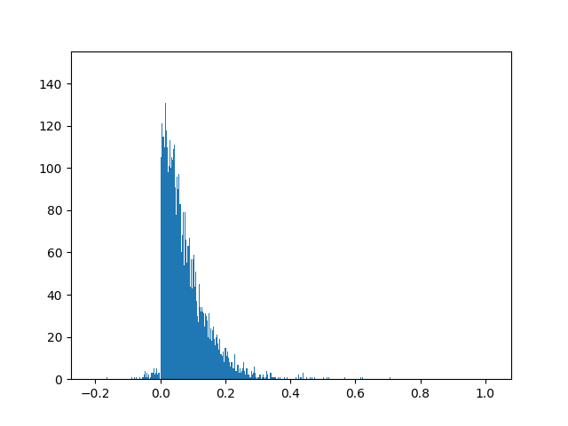

# Projet du cours d’algorithmique - ESIEE-Paris

## Introduction
Voici le projet du cours d'algorithmique de l'ESIEE-Paris, réalisé en novembre 2023. Ce projet explore les stratégies d'une coccinelle cherchant à manger le maximum de puceron sur une grille. Deux stratégies sont étudiées : la stratégie gloutonne et la stratégie optimale basée sur la programmation dynamique pour enfin analyser statistiquement les résultats.

## Sujet du Projet
### Coccinelle et Pucerons
Chaque case d'une grille de dimensions L lignes et C colonnes contient des pucerons. Une coccinelle se pose sur une case de la première ligne et se déplace vers la dernière ligne, en choisissant à chaque étape la case adjacente avec le plus grand nombre de pucerons. L'objectif est de déterminer le nombre total de pucerons que la coccinelle mangera en suivant ce chemin.

### Les résultats
Voici le graphique que nous avons pu générer qui montre la distribution des gains relatifs de la méthode optimale sur la méthode gloutonne.
\[ \text{gain}(d) = \frac{n_{\text{max}}(d) - n_{\text{g}}(d)}{n_{\text{g}}(d)} \]

## Conclusion
Ce projet explore les différentes stratégies d'une coccinelle pour maximiser sa consommation de pucerons. Les questions abordent la stratégie gloutonne, la programmation dynamique, les gains et la comparaison statistique des stratégies.